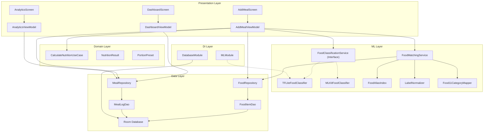
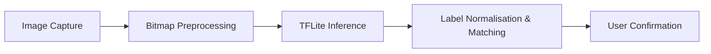

# NutriScan: AI-Powered Mobile Nutrition Tracking Application

## CSD3156 Mobile and Cloud Computing — Team Project Technical Report

---

**Team Name:** <!-- PLACEHOLDER: Your team name -->

**Team Members:**

| Name | Student ID | Contribution |
|------|-----------|--------------|
| <!-- PLACEHOLDER --> | <!-- PLACEHOLDER --> | <!-- PLACEHOLDER: e.g., ML pipeline, Food matching service, TFLite integration --> |
| <!-- PLACEHOLDER --> | <!-- PLACEHOLDER --> | <!-- PLACEHOLDER: e.g., Dashboard UI, Analytics screen, Calorie tracking --> |
| <!-- PLACEHOLDER --> | <!-- PLACEHOLDER --> | <!-- PLACEHOLDER: e.g., Data layer, Room database, Navigation --> |
| <!-- PLACEHOLDER --> | <!-- PLACEHOLDER --> | <!-- PLACEHOLDER: e.g., Camera integration, UI/UX design, Testing --> |

**Date:** <!-- PLACEHOLDER: Submission date -->

---

## Table of Contents

1. [Introduction](#1-introduction)
2. [Requirements & Planning](#2-requirements--planning)
3. [Software Architecture](#3-software-architecture)
4. [Technical Implementation](#4-technical-implementation)
5. [UI/UX Design](#5-uiux-design)
6. [Testing & Validation](#6-testing--validation)
7. [Demo Scenarios](#7-demo-scenarios)
8. [Team Member Contributions](#8-team-member-contributions)
9. [Conclusion & Future Work](#9-conclusion--future-work)
10. [References](#10-references)

---

## 1. Introduction

### 1.1 Project Overview

NutriScan is a native Android mobile application that enables users to track their daily nutritional intake through AI-powered food recognition. The application leverages a TensorFlow Lite machine-learning model to classify food items from images, matches the results against a local nutrition database, and computes per-portion macronutrient breakdowns (calories, protein, carbohydrates, and fat). Users can review, confirm, or override AI predictions before logging meals, and the application provides a real-time dashboard with animated progress visualisations and a 7-day analytics trend view.

The core differentiator of NutriScan over conventional calorie-counting apps is its integration of on-device machine learning for food identification, which eliminates the need for manual text-based food searches and reduces friction in the meal-logging workflow. The ML pipeline runs entirely on-device, ensuring privacy and offline capability.

### 1.2 Motivation & Problem Statement

Manual food logging is the primary barrier to sustained dietary tracking. Studies show that more than 50% of users abandon calorie-tracking apps within two weeks due to the tedium of searching and entering food data (Cordeiro et al., 2015). NutriScan addresses this by automating the identification step: users simply capture or select an image and receive an instant food identification with nutritional data, reducing a multi-step search process to a single tap.

### 1.3 Key Features

| Feature | Description |
|---------|-------------|
| **AI Food Classification** | On-device TFLite inference (Food-11 model) with 11-category classification expanding to 100+ specific food items |
| **Multi-Strategy Matching** | Hierarchical label-to-database matching: exact → alias → token → partial, with confidence scoring |
| **Real-Time Dashboard** | Animated calorie progress ring, live macro breakdown (protein/carbs/fat), weekly average display |
| **Portion Customisation** | Preset portion sizes (150g–500g) and custom gram input with instant nutrition recalculation |
| **7-Day Analytics** | Bar chart trend with trend line overlay, daily calorie breakdown, weekly average computation |
| **Manual Search Fallback** | Fuzzy food search with alias support when AI confidence is low or classification fails |
| **Camera Integration** | CameraX-based live preview with instant image capture and classification |

---

## 2. Requirements & Planning

### 2.1 Functional Requirements

The following functional requirements were identified during the planning phase and drove the design of the application:

| ID | Requirement | Priority | Status |
|----|-------------|----------|--------|
| FR-01 | Capture food images via camera or select from sample images | High | Implemented |
| FR-02 | Classify food items using an on-device ML model | High | Implemented |
| FR-03 | Match ML predictions to a local nutrition database (100+ items) | High | Implemented |
| FR-04 | Display candidate food matches with confidence scores for user confirmation | High | Implemented |
| FR-05 | Allow users to adjust portion size (presets and custom grams) | Medium | Implemented |
| FR-06 | Compute and display per-portion nutrition (kcal, protein, carbs, fat) | High | Implemented |
| FR-07 | Log meals with timestamped nutrition records | High | Implemented |
| FR-08 | Display daily calorie progress with animated ring chart | Medium | Implemented |
| FR-09 | Show macro breakdown (protein, carbs, fat) on dashboard | Medium | Implemented |
| FR-10 | Provide 7-day calorie trend analytics with chart visualisation | Medium | Implemented |
| FR-11 | Support manual food search with fuzzy query and alias matching | Medium | Implemented |
| FR-12 | Allow deletion of logged meals | Low | Implemented |

### 2.2 Non-Functional Requirements

- **Performance:** ML inference must complete within 2 seconds on mid-range devices (target: <1 s on Snapdragon 600-series).
- **Offline Capability:** All core features (classification, logging, analytics) must function without network connectivity.
- **Privacy:** No image data or personal dietary information is transmitted off-device.
- **Usability:** The meal-logging workflow must be completable in under 4 taps from the dashboard.

### 2.3 Development Workflow

The project followed an iterative, feature-driven development methodology:

1. **Sprint 1 – Foundation:** Project scaffolding, Room database schema, Hilt DI setup, base navigation.
2. **Sprint 2 – ML Pipeline:** TFLite model integration, food classification service interface, label normalisation.
3. **Sprint 3 – Food Matching:** Alias index, multi-strategy matching service, Food-11 category expansion.
4. **Sprint 4 – UI Layer:** Dashboard with calorie ring, Add Meal screen with camera/sample images, confirmation flow.
5. **Sprint 5 – Analytics & Polish:** 7-day trend chart, weekly averages, portion presets, error handling, edge-case fixes.

<!-- PLACEHOLDER: If you used any project management tools (Trello, Jira, GitHub Projects), describe the sprint board setup and task tracking here. Screenshots of the project board are recommended. -->

### 2.4 Tools & Technologies

| Category | Technology | Justification |
|----------|-----------|---------------|
| Language | Kotlin | First-class Android support, null safety, coroutine-native concurrency |
| UI Framework | Jetpack Compose + Material 3 | Declarative UI, built-in theming, state-driven rendering |
| Architecture | Clean Architecture (MVVM) | Separation of concerns, testable layers, DI-friendly design |
| Dependency Injection | Hilt (Dagger) | Compile-time DI for Android, scope management, ViewModel integration |
| Local Database | Room (SQLite) | Type-safe queries, Flow-based reactive data, compile-time SQL verification |
| ML Inference | TensorFlow Lite 2.14 | On-device inference, quantised model support, hardware acceleration |
| ML Fallback | Google ML Kit Image Labeling | Bundled on-device inference; used as alternative classifier |
| Camera | CameraX | Lifecycle-aware camera management, simplified API, Compose interop |
| Build System | Gradle KTS with KSP | Type-safe build scripts, fast annotation processing (Room, Hilt) |
| Serialisation | Gson | JSON parsing for database seeding from asset files |
| Reactive Streams | Kotlin Coroutines + Flow | Structured concurrency, backpressure handling, StateFlow for UI state |

---

## 3. Software Architecture

### 3.1 High-Level Architecture

NutriScan follows a **Clean Architecture** pattern organised into five distinct packages, ensuring unidirectional dependency flow from outer layers (UI) inward (domain):

```
com.nutriscan
├── data/            ← Data Layer (Room DB, repositories)
│   ├── local/       ← Database, DAOs, entities
│   └── repository/  ← Repository implementations
├── di/              ← Dependency Injection (Hilt modules)
├── domain/          ← Domain Layer (use cases, models)
│   ├── model/       ← Domain models (NutritionResult, PortionPreset)
│   └── usecase/     ← Business logic (CalculateNutritionUseCase)
├── ml/              ← Machine Learning Layer (classifiers, matching)
└── ui/              ← Presentation Layer (Compose screens, ViewModels)
    ├── addmeal/     ← Add Meal screen + ViewModel
    ├── analytics/   ← Analytics screen + ViewModel
    ├── dashboard/   ← Dashboard screen + ViewModel
    ├── navigation/  ← NavHost and route definitions
    └── theme/       ← Material 3 theme (Color, Type, Theme)
```

### 3.2 Architecture Diagram



### 3.3 Design Decisions & Rationale

**Interface-Based ML Classifier:** The `FoodClassificationService` interface decouples the classification strategy from the ViewModel. This allowed the team to begin development with ML Kit's generic image labeling and later swap to a food-specific TFLite model without modifying any UI or ViewModel code. The active implementation is configured via a single Hilt `@Binds` declaration in `MLModule`.

**In-Memory Alias Index:** The `FoodAliasIndex` provides O(1) lookups for food matching, replacing repeated `LIKE` queries against the Room database. This is critical because the matching pipeline is invoked multiple times per classification pass (once per ML prediction), and database I/O on the main thread would degrade responsiveness.

**Multi-Strategy Matching Pipeline:** Rather than relying on a single exact-name match, the pipeline tries multiple strategies in priority order (exact → alias → token → partial). This significantly increases the match rate when the ML model returns labels that differ in format from database entries (e.g., "Granny Smith Apples" → normalised to "granny smith apple" → token-matched to "apple").

**Denormalised MealLog:** The `MealLog` entity stores pre-computed nutrition totals (`kcalTotal`, `proteinTotal`, etc.) alongside the `foodItemId` foreign key. This eliminates JOINs in the analytics queries (daily totals, weekly averages), which are rendered as reactive `Flow` streams and would otherwise trigger repeated multi-table queries.

**StateFlow-Driven UI:** All UI state is managed through `MutableStateFlow` → `StateFlow` in each ViewModel. The use of `stateIn` with `SharingStarted.WhileSubscribed(5000)` ensures database flows are active only while the composable is in the foreground, with a 5-second grace period for configuration changes (rotation), balancing resource usage against user experience.

---

## 4. Technical Implementation

### 4.1 Food Classification Pipeline

The classification pipeline is the technical centrepiece of NutriScan. It processes an image through four stages:



#### Stage 1: Image Capture

Images are acquired via one of two pathways:
- **CameraX Live Capture:** A `PreviewView` renders the camera feed; tapping the capture button extracts the current frame as a `Bitmap` via `previewView.bitmap`.
- **Sample Image Selection:** Pre-loaded images from `assets/sample_images/` are decoded with `BitmapFactory.decodeStream()` and passed directly to the classifier.

Both pathways converge at `AddMealViewModel.classifyImage(bitmap)`, ensuring all images go through the full ML pipeline with no hardcoded food names.

#### Stage 2: Bitmap Preprocessing (`TFLiteFoodClassifier.preprocessBitmap`)

The captured bitmap is prepared for model input:

1. **Resize** to model input dimensions (192×192 pixels) using `Bitmap.createScaledBitmap()`.
2. **Allocate** a `ByteBuffer` matching the model's expected input tensor shape `[1, 192, 192, 3]`.
3. **Pixel extraction:** RGB channels are extracted from each pixel via bitwise operations (`shr 16`, `shr 8`, `and 0xFF`).
4. **Type-aware encoding:**
   - For `UINT8` models: raw byte values [0, 255] are written directly.
   - For `FLOAT32` models: values are normalised to [-1.0, 1.0] using the formula `(channel - 127.5) / 127.5`.

This dual-mode preprocessing ensures compatibility with both quantised and full-precision TFLite models.

#### Stage 3: TFLite Inference (`TFLiteFoodClassifier.classifyFood`)

The model is loaded from `assets/ml/food11.tflite` as a memory-mapped file (`MappedByteBuffer`) and executed via the TensorFlow Lite `Interpreter`:

- **Multi-threaded execution:** The interpreter is configured with 4 threads for parallel computation.
- **Dynamic tensor inspection:** Input and output tensor shapes and data types are read at runtime (not hardcoded), enabling model-agnostic inference.
- **Output parsing:** The top 10 predictions above a 5% confidence threshold are returned, filtered to exclude background and non-semantic labels (e.g., labels beginning with `/g/` or `/m/`).
- **Confidence tiering:** Results are classified into `HIGH_CONFIDENCE` (≥70%), `SINGLE_MATCH`, or `MULTIPLE_CANDIDATES` for differentiated UX handling.

#### Stage 4: Label Normalisation & Database Matching

This is the most algorithmically complex stage, involving three cooperating components:

**LabelNormalizer** — Transforms raw model output labels into a canonical form:
- Lowercasing and separator normalisation (`_`, `-` → space)
- Stopword removal (`food`, `dish`, `fresh`, `cooked`, etc.)
- Rule-based singularisation (e.g., "berries" → "berry", "tomatoes" → "tomato")
- Token extraction with priority ordering (full phrase → last token → prefix)

**Food11CategoryMapper** — Expands coarse Food-11 categories (e.g., "Meat", "Bread", "Seafood") into specific search terms. For example, the category "Meat" expands to `[beef, steak, pork, lamb, chicken, turkey, sausage, bacon, ham, burger, hamburger, meatball]`, enabling fine-grained database matching from coarse model output.

**FoodMatchingService** — Executes a ranked, multi-strategy matching pipeline:

| Priority | Strategy | Description | Example |
|----------|----------|-------------|---------|
| 1 | Exact Name | Normalised label matches `FoodItem.name` exactly | "banana" → banana |
| 2 | Alias Match | Label matches an entry in `FoodItem.aliases` | "plantain" → banana |
| 3 | Token Match | A sub-token of the label matches a food name | "granny smith apple" → apple |
| 4 | Partial Match | Contains-based substring match (low confidence) | "hamburger" ⊃ "ham" |

Each match is scored using a **combined score** formula:

```
combinedScore = ML_confidence × (matchType.score / 100)
```

Where `MatchType` scores are: EXACT = 100, ALIAS = 80, TOKEN = 60, PARTIAL = 30, NONE = 0. This prevents a high-confidence partial match from outranking a lower-confidence exact match.

The `FoodAliasIndex` provides O(1) lookups by maintaining two in-memory hash maps built at initialisation:
- `nameMap: Map<String, FoodItem>` — indexed by normalised food name
- `aliasMap: Map<String, FoodItem>` — indexed by each normalised alias

### 4.2 Data Layer

#### Room Database Schema

The application uses a Room database (`nutriscan_database`) with two tables:

**food_items** — Pre-populated nutrition reference data (seeded from `assets/food_items.json` on first launch):

| Column | Type | Description |
|--------|------|-------------|
| `id` | INTEGER (PK) | Auto-generated primary key |
| `name` | TEXT | Canonical food name |
| `kcal_per_100g` | INTEGER | Calories per 100g |
| `protein_per_100g` | REAL | Protein grams per 100g |
| `carbs_per_100g` | REAL | Carbohydrate grams per 100g |
| `fat_per_100g` | REAL | Fat grams per 100g |
| `tags` | TEXT (nullable) | Comma-separated tags (e.g., "breakfast,asian") |
| `aliases` | TEXT (nullable) | Alternative names (e.g., "fried rice,nasi goreng,炒饭") |

**meal_logs** — User's logged meals with pre-computed nutrition:

| Column | Type | Description |
|--------|------|-------------|
| `id` | INTEGER (PK) | Auto-generated primary key |
| `timestamp` | INTEGER | Unix timestamp (milliseconds) |
| `food_item_id` | INTEGER (FK) | References `food_items.id` (CASCADE delete) |
| `food_name` | TEXT | Denormalised food name for quick display |
| `grams` | INTEGER | Portion weight |
| `kcal_total` | INTEGER | Computed total calories |
| `protein_total` | REAL | Computed total protein |
| `carbs_total` | REAL | Computed total carbs |
| `fat_total` | REAL | Computed total fat |
| `source` | TEXT | Logging method ("ml" or "manual") |

Indices are defined on `food_item_id` and `timestamp` for query performance.

#### Database Seeding

On first launch, `DatabaseModule` detects an empty `food_items` table and seeds it from `assets/food_items.json` using Gson deserialisation. This one-time seeding runs synchronously via `runBlocking` during dependency injection to ensure the database is populated before any UI query occurs.

#### Analytics Queries

The `MealLogDao` defines several aggregate queries optimised for the analytics dashboard:

- **Today's Total Calories:** `SUM(kcal_total)` filtered by `timestamp >= startOfDay`
- **Today's Macros:** `SUM(protein_total)`, `SUM(carbs_total)`, `SUM(fat_total)` for the current day
- **7-Day Trend:** `GROUP BY date(timestamp / 1000, 'unixepoch', 'localtime')` with `SUM(kcal_total)` per day
- **Weekly Average:** Nested subquery computing `AVG(daily_total)` over daily sums

All analytics queries return `Flow` types, providing automatic UI updates when new meals are logged.

### 4.3 Dependency Injection

Hilt is used throughout the application for compile-time dependency injection:

- **`DatabaseModule`** (Singleton scope): Provides the `AppDatabase` instance, `FoodItemDao`, and `MealLogDao`. Handles database seeding logic.
- **`MLModule`** (Singleton scope): Binds the `FoodClassificationService` interface to its active implementation (`TFLiteFoodClassifier`). Switching to M ML Kit requires only changing this single binding.

All ViewModels are annotated with `@HiltViewModel` and receive dependencies via constructor injection, eliminating manual factory boilerplate.

### 4.4 Navigation

Navigation is implemented using Jetpack Navigation Compose with three sealed routes:

```kotlin
sealed class Screen(val route: String) {
    object Dashboard : Screen("dashboard")
    object AddMeal : Screen("add_meal")
    object Analytics : Screen("analytics")
}
```

The `NavHost` is configured in `NutriScanNavHost` with the Dashboard as the start destination. The Add Meal and Analytics screens support back-navigation via `popBackStack()`.

### 4.5 Technology Justifications

| Decision | Alternatives Considered | Rationale for Choice |
|----------|------------------------|---------------------|
| TFLite over cloud API | Google Vision API, AWS Rekognition | On-device inference provides zero-latency classification, offline support, and full data privacy (no image upload) |
| Room over raw SQLite | SQLDelight, Realm | First-class Kotlin/Flow integration, compile-time SQL verification, official Jetpack library |
| Hilt over manual DI | Koin, Kodein | Compile-time error detection, Android lifecycle-aware scoping, official Google recommendation |
| StateFlow over LiveData | LiveData, RxJava | Kotlin-native, backpressure support, coroutine integration, `stateIn` for lifecycle awareness |
| Compose over XML Views | XML + ViewBinding | Declarative paradigm, reduced boilerplate, built-in state management, and modern UI toolkit |

---

## 5. UI/UX Design

### 5.1 Design Principles

The UI design follows established HCI principles for mobile interaction:

- **Minimal Tap Depth:** The primary use case (scan → confirm → log) requires at most 3 taps from the dashboard.
- **Error Prevention & Recovery:** Low-confidence classifications display explicit warning banners. Users can override AI predictions via "Not this food?" → candidate list → manual search, ensuring they are never locked into an incorrect classification.
- **Progressive Disclosure:** The Add Meal screen uses a state-machine pattern to reveal information contextually (capture → candidates → confirmation → logged), avoiding cognitive overload.
- **Immediate Feedback:** Classification triggers a `CircularProgressIndicator` with "Analyzing with AI..." text; calorie ring animations provide visual confirmation of logged meals.
- **Consistent Visual Language:** Material 3 colour scheme with semantic colour coding (green = on track, orange = approaching limit, red = exceeded goal).

### 5.2 Screen Descriptions

#### 5.2.1 Dashboard Screen

The home screen provides an at-a-glance summary of the user's daily nutritional progress:

- **Calorie Progress Ring:** An animated arc chart (`Canvas`-drawn) showing consumed versus goal calories. The ring colour transitions dynamically: green (<80% of goal), orange (80–100%), red (>100%).
- **Macro Breakdown Row:** Protein, carbs, and fat displayed with colour-coded indicators (blue, orange, red respectively).
- **Weekly Average Card:** Displays the 7-day rolling average calorie intake.
- **Today's Meals List:** A `LazyColumn` of `MealLogItem` cards showing food name, portion weight, timestamp, and calories with swipe-to-delete functionality.
- **Floating Action Button:** Primary navigation to the Add Meal screen.

#### 5.2.2 Add Meal Screen

This screen implements a multi-stage state machine for the food logging workflow:

| State | UI Component | Trigger |
|-------|-------------|---------|
| **Capture** | `UnifiedFoodCapture` — Image grid with sample foods + manual search button | Initial state |
| **Classifying** | Loading overlay with spinner and "Analyzing with AI..." | Image tapped |
| **Candidate Selection** | `CandidateSelectionSheet` — Ranked list of food matches with confidence % | Multiple matches found |
| **Confirmation** | `ConfirmationSheet` — Food details, portion presets, nutrition summary | Food selected |
| **Logged** | Navigation back to Dashboard | "Log Meal" tapped |

The Candidate Selection sheet includes a confidence-aware banner: when the best prediction is below 60% confidence, an amber warning prompts users to verify or use manual search.

#### 5.2.3 Analytics Screen

A scrollable analytics view providing:

- **Weekly Summary Card:** Headline display of the 7-day average in a `primaryContainer`-themed card.
- **7-Day Calorie Trend Chart:** Custom `Canvas`-drawn bar chart with a trend-line overlay (`Path`-based), responsive to varying data ranges.
- **Daily Breakdown List:** Individual day rows showing date and total calories.

### 5.3 Mobile-Specific Design Considerations

| Feature | Mobile Consideration |
|---------|---------------------|
| **CameraX Integration** | Lifecycle-aware camera binding prevents resource leaks on configuration changes |
| **Touch Targets** | Capture button is 72dp (exceeds 48dp minimum); food cards use full-width clickable areas |
| **Portion Presets** | `LazyRow` of `FilterChip` components—horizontally scrollable for one-handed use |
| **Responsive Layout** | `LazyColumn`/`LazyVerticalGrid` ensure smooth scrolling on devices with varying screen sizes |
| **Offline First** | All data stored locally in Room; no network dependency for any core feature |

### 5.4 Design Trade-Offs

| Trade-Off | Decision | Rationale |
|-----------|----------|-----------|
| Sample images vs. camera-only | Both provided | Sample images allow demo/testing without camera permission; camera provides real-world usability |
| Auto-select vs. always confirm | Always show candidates | Reduced risk of incorrect silent logging; user trust is prioritised over speed |
| Denormalised meal data vs. JOIN queries | Denormalised `MealLog` | Eliminates complex JOINs in analytics queries; acceptable trade-off given insert-heavy, update-rare access pattern |
| Single-activity vs. multi-activity | Single activity with Compose Navigation | Simplified lifecycle management; Compose navigation handles back-stack efficiently |

---

## 6. Testing & Validation

### 6.1 Testing Strategy

| Level | Approach | Scope |
|-------|----------|-------|
| **Unit Testing** | JUnit 5 + Mockito | Use cases, label normalisation, match scoring logic |
| **Integration Testing** | AndroidJUnit4 + Room in-memory DB | DAO queries, repository flows, database seeding |
| **UI Testing** | Compose UI Test (JUnit4) | Screen rendering, state transitions, navigation |
| **Manual Testing** | Physical device (Android 11+) | Camera capture, end-to-end classification, edge cases |

### 6.2 Key Test Scenarios

| Test Case | Expected Behaviour | Result |
|-----------|--------------------|--------|
| Classify high-confidence food image | Shows confirmation sheet with correct food, ≥70% confidence | <!-- PLACEHOLDER: Pass/Fail --> |
| Classify ambiguous food image | Shows candidate selection with multiple options | <!-- PLACEHOLDER: Pass/Fail --> |
| Classify non-food image | Shows "No food detected" message + manual search prompt | <!-- PLACEHOLDER: Pass/Fail --> |
| Log meal and verify dashboard update | Calorie ring, macro row, and meal list update reactively | <!-- PLACEHOLDER: Pass/Fail --> |
| Delete a logged meal | Meal removed from list; totals recalculated immediately | <!-- PLACEHOLDER: Pass/Fail --> |
| Change portion size on confirmation | Nutrition values recalculate in real-time | <!-- PLACEHOLDER: Pass/Fail --> |
| Analytics after 7 days of data | Bar chart renders correct daily totals; weekly average is accurate | <!-- PLACEHOLDER: Pass/Fail --> |
| Database seeding on fresh install | 100+ food items loaded from JSON; immediate availability | <!-- PLACEHOLDER: Pass/Fail --> |
| Manual food search with partial query | Fuzzy results returned matching name or aliases | <!-- PLACEHOLDER: Pass/Fail --> |
| Food-11 category expansion | "Meat" category matches chicken, beef, pork, etc. in database | <!-- PLACEHOLDER: Pass/Fail --> |

### 6.3 Edge Cases & Debugging

| Issue Encountered | Root Cause | Resolution |
|-------------------|------------|------------|
| Input buffer size mismatch | Model expected `UINT8` (1 byte/channel) but preprocessing was writing `FLOAT32` (4 bytes/channel) | Implemented dynamic type detection from tensor metadata (`inputDataType`) to select preprocessing path |
| Empty food index on first classification | Database seeding (async) had not completed before classification was triggered | Added 1-second retry with `delay(1000)` and `isReady()` guard in `handleFoodDetected()` |
| "ham" partial-matching to "hamburger" | Overly greedy partial matching in `FoodAliasIndex` | Added minimum query length threshold (`minLength = 4`) for partial matches |
| ML Kit returning non-food labels (e.g., "Table", "Wood") | Generic model not trained on food-specific data | Introduced `FoodVocabulary` filter layer; later replaced with food-specific TFLite model |

---

## 7. Demo Scenarios

### Scenario 1: AI-Powered Meal Logging (Happy Path)

1. **Launch** the application → Dashboard displays with empty calorie ring at 0/2000 kcal.
2. **Tap** the floating "+" button → Navigate to Add Meal screen.
3. **Tap** a sample food image (e.g., curry chicken) → Loading spinner appears: "Analyzing with AI..."
4. **View** candidate list → AI identifies "Meat" category and expands to matching foods (e.g., Chicken — 85% confidence).
5. **Select** "Chicken" from the list → Confirmation screen shows: name, portion presets, nutrition breakdown.
6. **Choose** "Bowl (250g)" preset → Nutrition recalculates: 412 kcal, 78.5g protein, 0g carbs, 9.5g fat.
7. **Tap** "Log Meal" → Navigate back to Dashboard. Calorie ring animates from 0 to 412. Meal appears in "Today's Meals" list.

### Scenario 2: Low-Confidence Classification with Manual Override

1. **Capture** an ambiguous food image → AI returns low-confidence matches (<60%).
2. **View** amber warning banner: "Low confidence — the AI isn't sure. Please verify or search manually."
3. **Tap** "Search Manually Instead" → Manual search screen opens with search hint pre-filled.
4. **Type** "fried rice" → Fuzzy results display (matches name and aliases).
5. **Select** "Fried Rice" → Proceed to confirmation and log as normal.

### Scenario 3: Weekly Nutrition Analytics

1. After logging meals over several days, **tap** the "Analytics" button on the Dashboard.
2. **View** the Weekly Average card (e.g., "1,850 kcal/day").
3. **View** the 7-day bar chart with trend line showing calorie intake patterns.
4. **Scroll** to the Daily Breakdown section for per-day calorie totals.

<!-- PLACEHOLDER: Include annotated screenshots or screen recordings for each scenario. Use tools such as the Android Studio Emulator recording feature or a physical device screen capture. -->

---

## 8. Team Member Contributions

<!-- PLACEHOLDER: Fill in each team member's specific contributions. Be specific about which modules, files, and features each person was responsible for. -->

| Member | Modules Owned | Key Contributions |
|--------|--------------|-------------------|
| <!-- Name 1 --> | `ml/`, `di/MLModule` | Implemented TFLite food classifier, Food-11 category mapper, label normalisation pipeline |
| <!-- Name 2 --> | `data/`, `domain/`, `di/DatabaseModule` | Designed Room database schema, wrote DAOs and repositories, implemented nutrition calculation use case |
| <!-- Name 3 --> | `ui/dashboard/`, `ui/analytics/` | Built Dashboard UI with animated calorie ring, macro breakdown, weekly average; created Analytics screen with custom Canvas chart |
| <!-- Name 4 --> | `ui/addmeal/`, `ui/navigation/`, `ui/theme/` | Developed Add Meal state machine (capture → candidates → confirm → log), CameraX integration, manual search, navigation |

### Workload Distribution

<!-- PLACEHOLDER: Describe how the work was distributed. Include any collaboration patterns (e.g., pair programming sessions, code reviews). If you used Git, consider including a summary of commit activity per team member. -->

---

## 9. Conclusion & Future Work

### 9.1 Summary of Achievements

NutriScan demonstrates the integration of on-device machine learning with a robust Android architecture to solve a meaningful health-tech problem. Key technical achievements include:

- A **pluggable ML classifier architecture** that enables swapping between TFLite and ML Kit via a single DI binding.
- A **multi-strategy food matching pipeline** that handles the inherent mismatch between coarse ML model output labels and fine-grained nutritional database entries.
- A **fully reactive UI** where dashboard metrics, meal lists, and analytics charts update automatically via Room `Flow` streams without manual refresh triggers.
- A **complete offline-first design** with no network dependencies for any core feature.

### 9.2 Future Enhancements

| Enhancement | Description | Complexity |
|-------------|-------------|------------|
| Cloud sync | Firebase Firestore sync for cross-device meal history | High |
| Barcode scanning | ML Kit Barcode API integration for packaged food lookup | Medium |
| Custom food creation | Allow users to add custom food items with nutritional data | Low |
| Calorie goal adjustment | User-configurable daily calorie target via Preferences DataStore | Low |
| Notifications | Meal reminders via Android AlarmManager + NotificationCompat | Medium |
| Higher-accuracy model | Replace Food-11 (11 categories) with Food-101 (101 categories) or a custom-trained model | High |
| Photo history | Store captured food images with meal logs for visual diary | Medium |

---

## 10. References

<!-- PLACEHOLDER: Add references as appropriate for your submission format (IEEE, APA, etc.) -->

1. Cordeiro, F., Epstein, D. A., Thomaz, E., et al. (2015). "Barriers and Negative Nudges: Exploring Challenges in Food Journaling." *Proceedings of the 33rd Annual ACM Conference on Human Factors in Computing Systems (CHI '15)*, pp. 1159–1162.
2. Google Developers. (2024). *TensorFlow Lite Guide.* https://www.tensorflow.org/lite/guide
3. Android Developers. (2024). *Jetpack Compose.* https://developer.android.com/jetpack/compose
4. Android Developers. (2024). *Room Persistence Library.* https://developer.android.com/training/data-storage/room
5. Android Developers. (2024). *Hilt Dependency Injection.* https://developer.android.com/training/dependency-injection/hilt-android
6. Android Developers. (2024). *CameraX Overview.* https://developer.android.com/training/camerax
7. Google ML Kit. (2024). *Image Labeling.* https://developers.google.com/ml-kit/vision/image-labeling

---

*This report was prepared as part of the CSD3156 Mobile and Cloud Computing course. All source code is available in the project repository.*
[](https://)