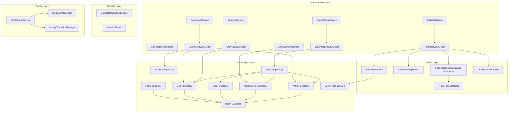
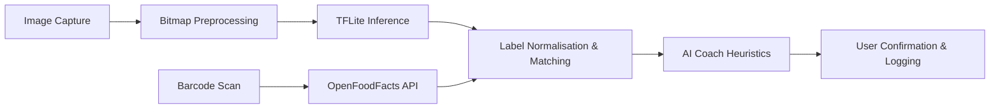
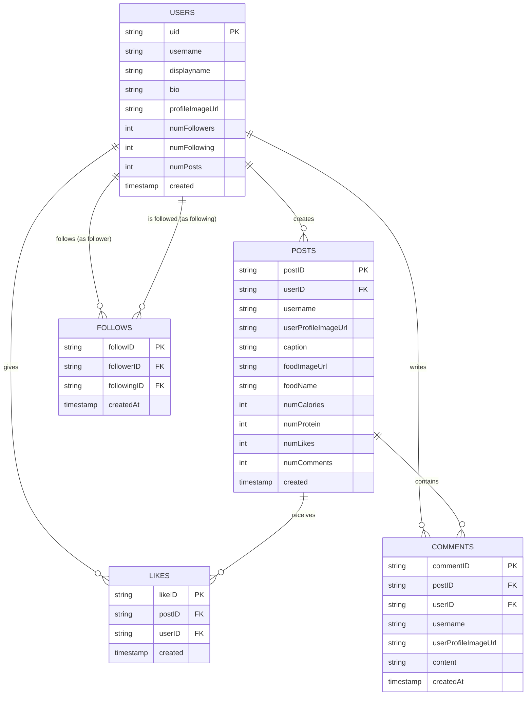

# NutriScan: AI-Powered Mobile Nutrition Tracking Application

## CSD3156 Mobile and Cloud Computing — Team Project Technical Report

---

**Team Name:** Team 2

**Team Members:**

| Name | Student ID |
|------|-----------|
| Fang Che Ee | 2301504 |
| Min Khant Ko | 2301320 |
| Brandon Gui | 2301229 |
| Tan Yong Wee | 2301256 |
| Lau Jia Win | 2301251 |
| Val Tay Yun Ying | 2301492 |

---

## Table of Contents

1. [Introduction](#1-introduction)
2. [Requirements & Planning](#2-requirements--planning)
3. [Software Architecture](#3-software-architecture)
4. [Technical Implementation: Core Systems](#4-technical-implementation-core-systems)
5. [Technical Implementation: Advanced Features](#5-technical-implementation-advanced-features)
6. [Technical Implementation: Social Features](#6-technical-implementation-social-features)
7. [UI/UX Design](#7-uiux-design)
8. [Testing & Validation](#8-testing--validation)
9. [Demo Scenarios](#9-demo-scenarios)
10. [Team Member Contributions](#10-team-member-contributions)
11. [Conclusion & Future Work](#11-conclusion--future-work)
12. [AI Usage Declaration](#12-ai-usage-declaration)
13. [Project Links](#13-project-links)
14. [References](#14-references)

---

## 1. Introduction

### 1.1 Project Overview

NutriScan is a native Android mobile application that enables users to track their daily nutritional intake and physical activity through **AI-powered food recognition** and **sensor-driven fitness monitoring**. The application leverages a TensorFlow Lite machine-learning model to classify food items from camera captures or gallery uploads, matches predictions against a 1,975-item local nutrition database, and computes per-portion macronutrient breakdowns (calories, protein, carbohydrates, and fat). In parallel, the application monitors physical activity through a dual-strategy step counter (hardware pedometer with accelerometer fallback) and Google's Activity Recognition Transition API, enabling calories-burned estimation and activity-aware tracking.

The core differentiator of NutriScan over conventional calorie-counting apps is its integration of on-device machine learning for food identification, hardware sensor fusion for activity detection, and algorithmic coaching. Since its inception, the app has evolved to include **Barcode Scanning** via the OpenFoodFacts API, an **AI Coach** that provides contextual dietary tips, animated **Water Tracking**, a **Food Diary** with daily drill-downs, an **Achievements** gamification system, and a native **PDF Export** engine to generate shareable holistic health reports.

### 1.2 Motivation & Problem Statement

Manual food logging is the primary barrier to sustained dietary tracking. Studies show that more than 50% of users abandon calorie-tracking apps within two weeks due to the tedium of searching and entering food data (Cordeiro et al., 2015). NutriScan addresses this by automating the identification step: users simply capture or select an image and receive an instant food identification with nutritional data, reducing a multi-step search process to a single tap. To further address user retention and engagement drops, NutriScan introduces gamification (streaks and badges) and proactive AI coaching to shift the app from a passive ledger to an active health companion.

### 1.3 Key Features

| Feature | Description |
|---------|-------------|
| **AI Food Classification** | On-device TFLite inference (Food-11 model) with 2,000+ cuisine labels, expanding to 1,975 database-matched food items |
| **Barcode Scanning** | Scanning packaged food barcodes to instantly pull nutritional data via the OpenFoodFacts API |
| **OCR Label Scanning** | Scanning nutrition fact labels to extract macros using ML Kit Text Recognition |
| **Dynamic AI Coach** | Algorithmic contextual insights displayed on the dashboard and upon food scans (e.g., macro warnings, swap suggestions) |
| **Camera Integration** | CameraX-based live preview with instant image capture, runtime permission handling, and lifecycle-aware binding |
| **Gallery Upload** | Android Photo Picker (`PickVisualMedia` API) with `ImageDecoder` for memory-safe bitmap conversion |
| **Step Counter & Pedometer** | Dual-strategy step detection: `TYPE_STEP_COUNTER` hardware pedometer (primary) with `TYPE_ACCELEROMETER` magnitude-peak-detection fallback (emulator-compatible) |
| **Activity Recognition** | Google Activity Recognition Transition API detecting WALKING, RUNNING, CYCLING, STILL, and IN_VEHICLE states; IN_VEHICLE automatically pauses step counting |
| **Calories Burned Tracker** | Foreground service with persistent notification, stride-based distance estimation, and activity-specific calorie calculation |
| **Real-Time Dashboard** | Animated calorie progress ring, live macro breakdown (protein/carbs/fat), step counter quick card, weekly average display |
| **Advanced Analytics & Diary** | 7-Day bar chart trends, macro breakdown charts. Interactive Food Diary allowing drill-down into past days |
| **Water Logging** | Daily water tracking featuring fluid interactive progress animations |
| **Gamification (Achievements)** | Track consistency with streaks and unlockable badges based on dietary and fitness milestones |
| **PDF Report Export** | Generates a fully formatted, 2-page native Android Canvas PDF detailing weekly performance, shareable via `FileProvider` |
| **New User Questionnaire** | Computes baseline TDEE and calorie targets dynamically upon the first launch |
| **Social Feed & Community** | Share meals globally with auto-calculated macros, follow friends, and engage via likes and comments |
| **User Profiles** | Customizable public user profiles with avatars, biographies, and social graph statistics (followers/following) |

---

## 2. Requirements & Planning

### 2.1 Functional Requirements

The following functional requirements were identified and implemented through agile iterations:

| ID | Requirement | Priority | Status |
|----|-------------|----------|--------|
| FR-01 | Capture food images via camera or upload from device gallery | High | Implemented |
| FR-02 | Classify food items using an on-device ML model | High | Implemented |
| FR-03 | Match ML predictions to a local nutrition database (1,975 items) | High | Implemented |
| FR-04 | Display candidate food matches with confidence scores for user confirmation | High | Implemented |
| FR-05 | Allow users to adjust portion size (presets and custom grams) | Medium | Implemented |
| FR-06 | Compute and display per-portion nutrition (kcal, protein, carbs, fat) | High | Implemented |
| FR-07 | Log meals with timestamped nutrition records | High | Implemented |
| FR-08 | Display daily calorie progress with animated ring chart | Medium | Implemented |
| FR-09 | Show macro breakdown (protein, carbs, fat) on dashboard | Medium | Implemented |
| FR-10 | Provide 7-day calorie trend analytics with chart visualisation | Medium | Implemented |
| FR-11 | Support manual food search with fuzzy query and alias matching | Medium | Implemented |
| FR-12 | Allow deletion of logged meals | Low | Implemented |
| FR-13 | Track daily steps via hardware pedometer or accelerometer fallback | High | Implemented |
| FR-14 | Detect user activity type (walking, running, cycling, vehicle) via Activity Recognition API | Medium | Implemented |
| FR-15 | Estimate distance and calories burned from step count and activity type | Medium | Implemented |
| FR-16 | Persist step tracking across app backgrounding via foreground service | High | Implemented |
| FR-17 | Pause step counting automatically when user is in a vehicle | Medium | Implemented |
| FR-18 | Scan packaged product barcodes for nutrition info | Medium | Implemented |
| FR-24 | Scan nutrition labels via OCR and automatically extract calories and macros | High | Implemented |
| FR-19 | Generate contextual tips based on user nutrition utilizing an AI Coach logic | High | Implemented |
| FR-20 | Log daily water intake with visual progress feedback | Low | Implemented |
| FR-21 | View historical logs via a dedicated Food Diary | Medium | Implemented |
| FR-22 | Export weekly analytics as a shareable PDF document | High | Implemented |
| FR-23 | Track user streaks and award badges | Medium | Implemented |
| FR-25 | Allow user account creation and authentication (Sign up / Sign in) | High | Implemented |
| FR-26 | Create and manage user profiles including custom profile pictures | Medium | Implemented |
| FR-27 | Publish food images to a public social feed with auto-calculated macros | High | Implemented |
| FR-28 | Edit and delete personal posts from the social feed | Medium | Implemented |
| FR-29 | Search for other users and view their profiles | Medium | Implemented |
| FR-30 | Follow and unfollow other users to customize a personalized feed | High | Implemented |
| FR-31 | Interact with community posts via likes and comments | High | Implemented |

### 2.2 Non-Functional Requirements

- **Performance:** ML inference must complete within 2 seconds on mid-range devices (target: <1 s on Snapdragon 600-series).
- **Offline Capability:** Core logging and sensor features must function without network connectivity. (Barcode and social features fallback gracefully).
- **Privacy:** No image data or personal dietary information is transmitted off-device implicitly.
- **Usability:** The mobile interaction pattern must ensure core flows (meal logging, tracking) require at most 4 taps from the dashboard.

### 2.3 Development Workflow

The project followed an iterative, feature-driven development methodology:

1. **Sprint 1 – Foundation:** Project scaffolding, Room database schema, Hilt DI setup, base navigation.
2. **Sprint 2 – ML Pipeline:** TFLite model integration, food classification service interface, label normalisation.
3. **Sprint 3 – Food Matching:** Alias index, multi-strategy matching service, Food-11 category expansion.
4. **Sprint 4 – UI Layer:** Dashboard with calorie ring, Add Meal screen with camera/gallery/sample images, confirmation flow.
5. **Sprint 5 – Sensor Integration:** Step counter sensor with accelerometer fallback, foreground service, Activity Recognition API, CaloriesBurned screen.
6. **Sprint 6 – Analytics & Polish:** 7-day trend chart, Gemini-powered nutritional data pipeline via python scripts, portion presets.
7. **Sprint 7 – Advanced Features & Engagement:** AI Coach heuristic engine, Barcode Scanning (OpenFoodFacts API), Water tracking animations, New User Questionnaire onboarding.
8. **Sprint 8 – Data Portability & Review:** Food Diary drill-downs, Achievements (Streaks & Badges), and native PDF Generation & Export pipeline.

### 2.4 Tools & Technologies

| Category | Technology | Justification |
|----------|-----------|---------------|
| Language | Kotlin | First-class Android support, null safety, coroutine-native concurrency |
| UI Framework | Jetpack Compose + Material 3 | Declarative UI, built-in theming, state-driven rendering |
| Architecture | Clean Architecture (MVVM) | Separation of concerns, testable layers, DI-friendly design |
| Dependency Injection | Hilt (Dagger) | Compile-time DI for Android, scope management, ViewModel integration |
| Local Database | Room (SQLite) | Type-safe queries, Flow-based reactive data, compile-time SQL verification |
| ML Inference | TensorFlow Lite 2.14 | On-device inference, quantised model support, hardware acceleration |
| ML Barcode Scanning | Google ML Kit Barcode API | Standalone barcode detection and bounding |
| REST API Clients | Retrofit & Gson | Used for OpenFoodFacts API integration |
| Camera | CameraX | Lifecycle-aware camera management, simplified API, Compose interop |
| Gallery Picker | AndroidX Activity Result (PickVisualMedia) | Modern Android Photo Picker contract; backward-compatible image selection |
| Sensor Framework | Android SensorManager (`TYPE_STEP_COUNTER`, `TYPE_ACCELEROMETER`) | Hardware pedometer for accurate step counting with accelerometer fallback |
| Activity Recognition | Google Play Services Activity Recognition API | ML-based activity detection (walking, running, cycling, vehicle) |
| Foreground Service | Android LifecycleService | Persistent background step tracking with notification, wake locks |
| Native Document Gen | `android.graphics.pdf.PdfDocument` | Generating native, multipage PDF documents entirely on device |

---

## 3. Software Architecture

### 3.1 High-Level Architecture

NutriScan follows a **Clean Architecture** pattern organised into discrete packages, ensuring unidirectional dependency flow from outer layers (UI) inward (domain):

```text
com.nutriscan
├── data/                ← Data Layer (Room DB, repositories)
│   ├── local/           ← Database, DAOs (MealLog, StepLog, ActivityLog, WaterLog)
│   └── repository/      ← Implementations (Food, Meal, Step, Activity, AICoach, Report)
├── di/                  ← Dependency Injection (Hilt modules: Database, ML, Sensor)
├── domain/              ← Domain Layer (use cases, models)
├── ml/                  ← Machine Learning Layer (classifiers, matching)
├── sensor/              ← Sensor Layer (step detection, activity recognition)
└── ui/                  ← Presentation Layer (Compose screens, ViewModels)
    ├── addmeal/         ← Add Meal screen (Camera, Gallery, Barcode, Samples)
    ├── activity/        ← Activity Tracker screen + ViewModel
    ├── analytics/       ← Analytics screen + Food Diary Drill-down
    ├── dashboard/       ← Dashboard screen (Water, Coach tip view)
    ├── export/          ← PDF Generation and Export Review screen
```

### 3.2 Architecture Diagram



### 3.3 Design Decisions & Rationale

**Interface-Based ML Classifier:** The `FoodClassificationService` interface decouples the classification strategy from the ViewModel. This allowed the team to begin development with ML Kit's generic image labeling and later swap to a food-specific TFLite model without modifying any UI or ViewModel code. The active implementation is configured via a single Hilt `@Binds` declaration in `MLModule`.

**In-Memory Alias Index:** The `FoodAliasIndex` provides O(1) lookups for food matching, replacing repeated `LIKE` queries against the Room database. This is critical because the matching pipeline is invoked multiple times per classification pass (once per ML prediction), and database I/O on the main thread would degrade responsiveness.

**Denormalised MealLog:** The `MealLog` entity stores pre-computed nutrition totals (`kcalTotal`, `proteinTotal`, etc.) alongside the `foodItemId` foreign key. This eliminates JOINs in the analytics queries (daily totals, weekly averages), which are rendered as reactive `Flow` streams and would otherwise trigger repeated multi-table queries.

**StateFlow-Driven UI:** All UI state is managed through `MutableStateFlow` → `StateFlow` in each ViewModel. The use of `stateIn` with `SharingStarted.WhileSubscribed(5000)` ensures database flows are active only while the composable is in the foreground, with a 5-second grace period for configuration changes (rotation), balancing resource usage against user experience.

---

## 4. Technical Implementation: Core Systems

### 4.1 Food Classification Pipeline

The classification pipeline is the technical centrepiece of NutriScan. It processes an image through four stages:



#### Stage 1: Image Acquisition

Images are acquired via multiple pathways converging at `AddMealViewModel.classifyImage(bitmap)`:

- **CameraX Live Capture:** Uses `ProcessCameraProvider` bound to the composable's `LifecycleOwner`. The capture button extracts the current frame via `previewView.bitmap`.
- **Gallery Upload:** Invokes the modern Android Photo Picker via `ActivityResultContracts.PickVisualMedia()`. Bitmaps are decoded using `ImageDecoder.decodeBitmap()` with `ALLOCATOR_SOFTWARE` on API 28+ to ensure Compose Canvas compatibility.
- **Barcode Parsing:** Utilizing ML Kit, frames are rapidly analyzed for barcodes. Recognized  EAN arrays are sent via Retrofit to OpenFoodFacts.

#### Stage 2: Bitmap Preprocessing (`TFLiteFoodClassifier.preprocessBitmap`)

The captured bitmap is prepared for model input:
1. **Resize** to model input dimensions (192×192 pixels) using `Bitmap.createScaledBitmap()`.
2. **Allocate** a `ByteBuffer` matching the model's expected input tensor shape `[1, 192, 192, 3]`.
3. **Pixel extraction:** RGB channels are extracted from each pixel via bitwise operations (`shr 16`, `shr 8`, `and 0xFF`).
4. **Type-aware encoding:** Detects raw `UINT8` arrays vs `FLOAT32` bounding targets dynamically.

#### Stage 3: TFLite Inference (`TFLiteFoodClassifier.classifyFood`)

The model is loaded from `app/src/main/assets/ml/food11.tflite` as a memory-mapped file (`MappedByteBuffer`) and executed via the TensorFlow Lite `Interpreter` scaled across 4 threads. Input/Output tensor shapes are not statically defined, they are inspected through `getInputTensor()`, preventing crashes should a new model be bundled.

#### Stage 4: Label Normalisation & Database Matching

**LabelNormalizer** — Transforms raw model output labels into a canonical form: Lowercasing, separating standardisation, stopword removal, and rule-based singularisation (e.g. "tomatoes" to "tomato").

**FoodMatchingService** — Executes a ranked, multi-strategy matching pipeline:
| Priority | Strategy | Description | Example |
|----------|----------|-------------|---------|
| 1 | Exact Name | Normalised label matches `FoodItem.name` exactly | "banana" → banana |
| 2 | Alias Match | Label matches an entry in `FoodItem.aliases` | "plantain" → banana |
| 3 | Token Match | A sub-token of the label matches a food name | "granny smith apple" → apple |
| 4 | Partial Match | Contains-based substring match (low confidence) | "hamburger" ⊃ "ham" |

Each match is scored via a **combined score** formula: `combinedScore = ML_confidence × (matchType.score / 100)`. Where `MatchType` scores are: EXACT=100, ALIAS=80, TOKEN=60, PARTIAL=30. This explicitly prevents high-confidence partial substring matches (0.95 × 0.30 = 0.285) from outranking mid-confidence exact matches (0.60 × 1.00 = 0.60).

#### Disclaimer: ML Food Identification Constraints
If a user takes an image of a food that is not in the `food_items.json` file consisting of the approximately 2,000 types of food, the food identification will not work. So one way the user can ensure the image is "valid" for use is to use the search bar in the Add Meal page and search for the food he took an image of. If the food exists ,the image is a food the ML Model has been trained on and will identify successfully.

### 4.2 Data Persistence (Room Database & Firebase)

#### Local & Cloud Database Architecture
NutriScan utilizes a seamless hybrid data layer. Local, high-frequency, and privacy-centric data is persisted offline via a Room Database (schema version 5), while community-driven content is synchronized globally using Firebase Cloud Firestore.

**Local Room Schema Domains:**
- **food_items:** Reference datasets (`kcal_per_100g`, `macros`, `aliases`).
- **meal_logs:** Pre-computed log instances (`kcal_total`, `grams`).
- **step_logs:** Distance mapped to timestamps (`steps`, `distance_meters`).
- **activity_logs:** Detected movements (WALKING, CYCLING, IN_VEHICLE).
- **water_logs:** Temporal fluid intake mapping (ms timestamp, `ml` capacity).

**Cloud Firestore Schema Domains:**
While Section 6 explicitly details the social architecture, we emphasize that NutriScan is not limited to local computing. Global data structures (User Profiles, Posts, Likes, Comments, and Relationship Graphs) are distributed across scalable, real-time NoSQL Firestore collections. This hybrid approach enables highly responsive local tracking with seamless cross-device social synchronization.

#### Automatic Database Seeding
On first database creation, a `RoomDatabase.Callback` triggers asynchronous seeding on `Dispatchers.IO` to insert 1,975 food records from `src/main/assets/food_items.json`. A Hilt `Provider<FoodItemDao>` breaks the circular injection dependency between the builder and the DAO.

### 4.3 Sensor Layer: Step Tracking & Activity

#### Dual-Strategy Sensor Manager (`StepCounterSensor`)

**Primary Strategy (`TYPE_STEP_COUNTER`):** Uses the device's hardware pedometer. Because it reports an absolute count since reboot, the system sets an `initialSensorValue` baseline on instantiation and deducts it to provide accurate session deltas.

**Fallback Strategy (`AccelerometerStepDetector`):** To provide broad device and emulator comparability, a fallback raw detector calculates the 3D-axis scalar magnitude: $magnitude = \sqrt{x^2 + y^2 + z^2}$. 
A step occurs if $magnitude > 12.0 m/s^2$ with a debounce rate of 300ms.

#### Foreground Service & Context Awareness (`StepCounterService`)
The tracking service runs on a `START_STICKY` intent featuring a `PARTIAL_WAKE_LOCK`. It interfaces constantly with Google's Play Services *Activity Recognition Transition API*. By capturing events asynchronously via a broadcast `goAsync()` receiver, the system filters out sensor noise. If `IN_VEHICLE` is detected, step accumulation and stride conversion halt immediately.

---

## 5. Technical Implementation: Advanced Features

### 5.1 Nutritional Coaching Engine (`AICoachRepository`)

Beyond passive charts, NutriScan introduces proactive health intervention. The `AICoachRepository` houses algorithmic generators that parse real-time statistics (Net Calories, Target Goals, Day Timeframes).

If total fat allocation exceeds 60% of daily targets before 2:00 PM, the Dashboard generates an orange-tinted `CoachInsight` ("You are over-indexing on Fat early in the day. Ensure dinner has mostly lean poultry").

Additionally, this logic overlaps during food classification. Scanning a calorically dense item triggers immediate situational swap suggestions in the form of alert banners before the user logs the food. 

**Independent Coach's Tip (Add Meal)**
Separate from the heavy heuristic engine, the Add Meal screen features a lightweight, randomized "Coach's Tip" integrated natively into the top app bar. This provides users with rotating, bite-sized nutritional facts (e.g., benefits of hydration, macro-balancing tips) to encourage sustained education without requiring a full statistical breakdown of their current daily intake.

### 5.2 PDF Report Generator

Exporting analytics required interfacing directly with the OS Document subsystem. The feature relies upon a bespoke `ReportRepository` which acts as a `Mutex` locked junction to perform concurrent async queries across Room DAOs (Meals, Steps, Water) and merge them into a single `WeeklyReportData` payload.

The payload is passed to the `PdfReportGenerator`:
- Utilizes `android.graphics.pdf.PdfDocument`.
- Manually bounds coordinates (X, Y) corresponding to an A4 (595x842) layout.
- Draws textual headers, custom stroked `Path` trend-lines (Net Calories), Stacked Macro Bars, and Badges using standard `android.graphics.Canvas` paint configurations.
- Serialized to `app-cache` and exported globally utilizing an AndroidX XML-configured `FileProvider` so other apps can send the file.

### 5.3 Barcode Scanning Integration (OpenFoodFacts API)

In addition to visual AI classification, NutriScan includes a deterministic lookup method for packaged goods via barcode scanning. Utilizing the Google ML Kit Barcode API, the live camera feed is rapidly analyzed to detect standardized EAN-13 and UPC-A formats.
- **RESTful API Integration**: Once a valid code is resolved, an asynchronous network request is dispatched via Retrofit to the Open Food Facts API—a vast, crowd-sourced global nutrition database.
- **Data Extrapolation**: The JSON response is parsed to automatically extract matching brand, product name, and precise macronutrients based on serving sizes, injecting them directly into the Add Meal flow.

### 5.4 New User Questionnaire & Macro Routing

Instead of hardcoding static basal metabolic rates, NutriScan calculates precise personalized macronutrient distributions dynamically.
- **Anthropometric Input**: Upon first launch, a 3-step Compose paginated View (`QuestionnaireViewModel`) collects Goal (Loss, Maintenance, Gain), Gender, Age, Height, Weight, and Activity Level.
- **TDEE Engine (`NutritionCalculator`)**: The `Mifflin-St Jeor` equation computes standard BMR, multiplied by categorized activity coefficients. Goal modifiers statically apply scalar adjustments (e.g., Fat Loss = 0.8x TDEE, Muscle Gain = 1.2x TDEE).
- **Macro Linking**: Raw calories distribute rationally: Protein computes linearly based on goal gravity (e.g., 2.5x body weight for muscle gain vs 1.8x for maintenance). Fat occupies a strict 25% caloric cap, while Carbohydrates consume the dynamic remainder.
- **State Management**: Results push through `saveTargetsToDataStore()` firing Kotlin Flows to update the Dashboard's primary ring charts and the User Profile in real time.

### 5.5 Deep Dive: Core Engineering & Algorithmic Implementations

In alignment with advanced technical criteria, NutriScan integrates several highly sophisticated systems that extend far beyond basic CRUD operations. The following architectures highlight the concrete engineering challenges solved within the application's core feature set:

#### 1. Algorithmic Data Processing & Gemini AI Pipeline
To construct the local 1,975-item database, a multi-stage Python pipeline was engineered to communicate with the Gemini 2.5 Flash API:
- **`1_clean_labels.py`**: A pre-processing script utilizing regex (`r'^/[gm]/'`) to structurally sanitize raw Food-11 classification metadata by stripping out Knowledge Graph IDs and background string artifacts.
- **`2_generate_nutrition.py`**: Engineered complex zero-shot system prompts forcing the LLM to return strictly formatted JSON arrays containing precise mathematical macronutrient breakdowns. To respect API rate limits and optimize generation time, the script implemented grouped array batching (100 labels per call) coupled with recursive exponential backoff mechanisms.
- **`3_merge_and_deploy.py`**: A deployment linker that dynamically merged the AI-generated JSON entities back into the primary USDA validation tables—using the label names as deterministic primary keys to prevent data overwrites—before injecting the final output directly into the Android `assets` directory.

#### 2. Computer Vision & Machine Learning (CV/ML)
We engineered a multi-stage on-device ML pipeline. Rather than relying solely on cloud APIs, we host a quantized TensorFlow Lite (Food-11) model directly on the device.
- **Memory-Safe Bitmap Preprocessing**: Raw camera frames and gallery intents are physically resized (`createScaledBitmap`) and memory-mapped into a finite `ByteBuffer`. To prevent memory leaks inherent with Android `ImageDecoder` utilizing hardware buffers, `ALLOCATOR_SOFTWARE` protocols were enforced.
- **OCR Regex Extraction Strategy**: For unstructured nutrition labels, the `OCRScannerService` deploys multi-line Regex tracking. The algorithm sequentially scans for nutrient anchor keywords (e.g., "Calories", "Protein"), falling back to adjacent optical lines if the value is separated by bounding box artifacts. Serving sizes are mathematically evaluated and scaled to create a normalized 100g database entity.
- **Constraint-Based Matching Algorithms**: The matching engine evaluates string hashes via a strict formula (`combinedScore = ML_confidence × (matchType.score / 100)`). This prevents high-confidence partial string substrings ("hamburger") from mathematically outranking lower-confidence direct alias connections ("plantain" -> "banana").

#### 3. Complex Multi-Threaded UI & Native Canvas Graphics
The application features rendering topologies that push Jetpack Compose beyond standard Material layouts:
- **Fluid Wave Tracking**: The water logging component natively computes a sine wave utilizing complex `Path()` vector trigonometry over the Compose `Canvas`. The wave offsets its phase angle continuously using an `infiniteRepeatable` hardware transition, creating a responsive 60fps liquid simulation.
- **Confetti Particle Engine**: Triggered upon hitting target metrics, a highly optimized multi-particle system generates hundreds of elements. The engine calculates randomized physical trajectories, gravity modifiers, and bounded rotation matrices for each coordinate simultaneously without sacrificing UI frame pacing.

#### 4. Robust Social Integration & Firestore State Management
The social environment integrates heavily with Firebase, utilizing complex NoSQL document schemas and atomic operations:
- **Denormalization Strategies**: To minimize read latency and prevent costly aggregation queries during feed generation, user metrics (e.g., `username`, `profileImageUrl`) are denormalized directly into individual `Post` and `Comment` documents.
- **Atomic Transactions & Batch Writes**: To maintain data integrity within a distributed environment without locking the UI thread, engagement features utilize atomic operations. For example, liking a post executes a write to the `likes` collection and simultaneously uses `FieldValue.increment(1)` directly on the `posts` document to ensure synchronized like-counts. Adding comments executes identical `runTransaction` batch writes.
- **Background Heuristic Workers**: To ensure the social feed remains dynamic, the `trendingScore` for each post—calculated via a custom time-decay algorithm—is not purely static. Native Android `WorkManager` instances execute multi-threaded, periodic un-obtrusive background syncs to recalculate decay factors for millions of objects without stalling the foreground session.

---

## 6. Technical Implementation: Social Features

To encourage user engagement with the app and build a community around health and nutrition, NutriScan includes social interactions. Users can create an account and share their meals, interact with others and discover new food. This transforms the app to not just being a personal tracker but a social platform as well. The implementation leverages Firebase services for a scalable, real-time and serverless backend architecture.

### 6.1 Social Architecture Overview

Build on Google's Firebase platform, utilizing a suite of integrated services to handle authentication and database storage and cloudinary to handle user-generated storage. This allows rapid development, real-time synchronization and minimal backend maintenance.

- **Firebase Authentication:** Manages user sign-up and sign-in flows.
- **Cloud Firestore:** Serves as the primary for all social data. Its real-time listeners enable live updates for feeds, likes and comments without requiring manual refreshes.
- **Cloudinary:** Storage and retrieval of user-generated content, primarily food posts images.
- **WorkManager:** Orchestrates background tasks e.g. periodic recalculation of post trending scores, ensuring dynamic feed

### 6.2 Data Models & Firestore Schema

To manage the complex relationships between users, posts, and engagement, we designed a scalable NoSQL schema optimized for read-heavy operations.



| Collection | Document Structure | Description |
|----------|----------|-------------|
| `users` | `User` (uid, username, displayname, bio, profileImageUrl, numFollowers, numFollowing, numPosts, created, email) | Stores public user profiles. Denormalized counts (e.g. numFollowers) are used to avoid costly aggregation queries |
| `posts` | `Post` (postID, userID, username, userProfileImageUrl, caption, foodImageUrl, foodName, numCalories, numProtein, numLikes, numComments, created, trendingScore) | Contains all user-shared food posts. User data (username, profile image) is denormalized here to allow for efficient feed rendering without needing to join with the `users` collection. |
| `likes` | `Like` (likeID, postID, userID, created) | Tracks which users have liked which posts. The `likeID` is a composite key (`{postID}_{userID}`) to ensure a user can only like a post once and to enable efficient lookups. |
| `comments` | `Comment` (commentID, postID, userID, username, userProfileImageUrl, content, createdAt) | Stores comments on posts. Similar to posts, user information is denormalized for efficient display. |
| `follows` | `Follow` (followID, followerID, followingID, createdAt) | Manages the social graph. The `followID` is a composite key (`{followerID}_{followingID}`) to prevent duplicate follows and allow quick checks. |

### 6.3 Core Social Interactions

The module is built around a set of core user interactions, implemented as a reactive flow within the `SocialRepository`

**Post Creation, Media Upload, and ML Integration**

The process of sharing a meal is a multi-step transaction handled by `SocialRepository.createPost`. It ensures data consistency across Firestore and Storage, while uniquely integrating our core ML features into the social experience.

1. **Authentication Check**: The function first verifies that a user is authenticated.
2. **ML Meal Recognition**: When a user takes an image of their food for a social post, the image is passed through the on-device TFLite model. The system automatically classifies the item and queries the local nutrition database to determine exact macronutrient values (calories, protein, carbs, fat).
3. **Image Upload:** The provided `imageUri` is uploaded to Firebase Storage via `uploadPostImage`. For development, locally absolute URIs fall back to simple string processing.
4. **Profile & Macro Enrichment:** It fetches the user's profile from the `users` collection to embed the `username` and `profileImageUrl` directly into the `Post` object, denormalizing the data for feed efficiency. The automatically determined calories and macros are also attached to the post data.
5. **Trending Score Calculation:** A `trendingScore` is calculated for the posts using an algorithm (`calculateTrendingScore`) that factors in initial engagement (likes, comments) and post freshness.
6. **Firestore Commit:** The new `Post` document is written to the `posts` collection and a batch operation increments the user's `numPosts` count.

**Reactive Feed Generation**

Feed is generated reactively using Firestore's real-time listeners.

- **Following Feed** (`getFeedPostsRealtime`): This function sets up 2 listeners, The first listens for changes to the current user's `follows` collection. Whenever this list updates, a second listener is automatically re-attached to the `posts` collection, querying for posts from the newly updated list of followed users. This creates a dynamic feed that updates in real-time as the user follows or unfollows others.
- **All Feed** (`getAllPosts`): A simpler listener that streams the most recent posts from the entire `posts` collection, ordered by `trendingScore` to highlight popular content.

**Engagement (Likes & Comments)**

Engagement features are designed as atomic, transactional updates to maintain data integrity.

- **Liking/Unliking** (`likePost`/`unlikePost`): These operations write or delete a document in the `likes` collection. Crucially, they are followed by an atomic increment or decrement of the `numLikes` field on the corresponding Post document using `FieldValue.increment()`. This keeps the post's like count consistent without requiring a separate aggregation query.

- **Commenting** (`addComment`): Adding a comment is executed as a Firestore **batch write**. This ensures that both the new comment document in the `comments` collection and the incremented `numComments` field on the parent `Post` are saved together atomically, preventing data inconsistency.

**Social Graph (Following)**
The follow/unfollow mechanism (`followUser`/`unfollowUser`) is also implemented with batch-like consistency.

When a user follows another, a document is created in the `follows` collection.

This action triggers two updates: incrementing the follower's `numFollowing` count and incrementing the followed user's `numFollowers` count. These counter updates are performed sequentially to keep user profiles accurate.

### 6.4 Advanced Social Features

Beyond core interactions, the social module includes features to enhance content discovery and engagement.

**Trending Score Algorithm**

To ensure the feed remains fresh and engaging, a `trendingScore` is calculated for each post. The algorithm in `SocialRepository` uses a time-decay function to balance popularity with novelty.

- **Formula**: The current implementation uses `engagement / (hoursSincePost + 2)^decayFactor`.

- **Logic**: Posts receive a high score immediately after creation if they have high engagement (likes and comments). As time passes (`hoursSincePost` increases), the score decays. The `decayFactor` is increased after 24 hours to age out older content more aggressively. This encourages the display of recent, popular posts.

**Background Trending Updates (`TrendingScoreWorker`)**

To prevent the `trendingScore` from becoming stale, a background task is scheduled using Android's `WorkManager`.

- `TrendingScoreWorker`: This `CoroutineWorker` is triggered periodically (e.g. every hour) by a `PeriodicWorkRequest`.

- **Function**: It iterates through all posts in the Firestore database, recalculates their trending score based on current like/comment counts and the current time, and updates the `trendingScore` field. This ensures that the feed's sorting remains dynamic even without new user interactions.

**User Search**

The `searchUsers` function in `SocialRepository` implements a client-side ranking system to provide relevant search results despite Firestore's limited full-text search capabilities.

1. **Initial Fetch:** It performs a range query on the `username` field based on the first character of the search query to get a manageable sample of users.

2. **Client-Side Ranking:** The results are fetched and then ranked in Kotlin based on a `scoreMatch` function. This function assigns higher scores for exact matches and matches that occur earlier in the `username` or `displayname` string.

3. **Fallback Mechanism:** If the initial sample yields insufficient results, the function falls back to fetching a larger, un-indexed sample to ensure users can find who they are looking for.

This comprehensive social layer transforms NutriScan from a solitary tracking tool into a vibrant community, encouraging users to engage with both the app and each other.

---

## 7. UI/UX Design

### 7.1 Design Principles

- **Minimal Tap Depth:** The primary use case (scan → confirm → log) requires at most 3 taps from the dashboard.
- **Error Prevention:** Low-confidence classifications (<60% confidence) trigger warning banners, offering users manual override.
- **Progressive Disclosure:** First-launch logic isolates configuration. Users walk through a paginated New User Questionnaire evaluating demographics (Height, Weight, Gender, Age) to compute optimal TDEE factors.

### 7.2 Screen Descriptions

#### Dashboard
- **Calorie Progress Ring / Summary:** An animated ring mapping dynamic Net Calories (Food Kcal - Walked Kcal).
- **AI Coach Display:** Card displaying real-time situational advice metrics.
- **Water Progress:** Animated fluid vector graph.

#### Add Meal Sequence
A robust State Machine pattern manages UI views depending on data pipelines:
- Lands on a unified picker (Camera, PickVisualMedia, Barcode icon).
- Transition state indicates "Analyzing...".
- Tapping a returned food card pushes values down to the Confirmation Sheet containing customizable `LazyRow` filter chips of various generic portion scales (e.g. 250 Bowl, 500g Plate).

#### Analytics & Food Diary
A layered scrollable layout:
- Features 7-Day Net Calorie histories.
- A **Food Diary Drill-Down** enables clicking a day mapping directly to a Bottom Sheet containing every individual meal logged for retroactive auditing.

#### Achievements Gamification
Intrinsic and Extrinsic Motivation logic. Consecutive `water_log` inputs or `step_log` bounds award Badges (e.g., "7-Day Streak!" or "Hydration Hero"). Data triggers localized animations upon badge attainment.

---

## 8. Testing & Validation

### 8.1 Testing Strategy

| Level | Approach | Scope |
|-------|----------|-------|
| **Unit Testing** | JUnit 4 (65+ tests) | Label normalisation, ML Alias Indexing, Heuristics engine logic, String mapping, Nutrition Calculator BMR/TDEE math, Macro Splits. |
| **Integration Testing** | AndroidJUnit4 + in-memory Room DB | Cross-DAO Room queries, recursive `ReportRepository` joins. |
| **UI Testing** | Compose UI Test | Rendering edge cases, navigation state losses. |
| **Device / Emulator** | End-to-end device trials | CameraX OOM faults, WakeLock tracking validation. |

#### 8.1.1 Configured Unit Test Cases

The application features an extensive suite of pure Kotlin unit tests divided into logical "Tiers" targeting the robustness of core calculation algorithms, AI pipelines, and data transformations.
Tests were authored primarily to explicitly replicate production logic and validate its mathematical and logical properties under boundary, extreme, and malformed inputs.

The test cases and their execution targets include:

**Tier 1: Core Mathematical Algorithms & Domain Logic**
*   `NutritionCalculatorTest.kt`: Validates the Mifflin-St Jeor BMR equation, TDEE scaling based on physical activity levels, personalized macro split constraints (e.g., protein mapping to BMI vs fat caps), and verifies proper `IllegalArgumentException` throws on negative body traits.
*   `CalculateNutritionUseCaseTest.kt`: Ensures the correct application of scaled gram multipliers onto baseline 100g database constants during portion size selection.
*   `TrendingScoreTest.kt`: Validates the time-decay algorithm used for social posts, verifying that engagement scores correctly degrade over simulated chronological hours.
*   `AccelerometerStepDetectorTest.kt` & `StepCounterServiceTest.kt`: Validates sensor magnitude logic and tests the debouncing window for step accumulations.

**Tier 2: AI Pipelines & Computer Vision Data Transforms**
*   `LabelNormalizerTest.kt`: Validates that the pre-processing string normalization layer successfully drops pluralization, lowercase cases, and strips defined non-essential descriptors before interacting with the local alias database to prevent false negatives.
*   `OCRParsingTest.kt`: Exercises the `OCRScannerService` regex logic. Tests validate the service's ability to extract key metrics (Calories, Proteins) regardless of malformed inputs, multi-line splits, extraneous punctuation (e.g., colons, commas), and lowercase/uppercase optical variations.

**Tier 3: Complex Game & Gamification State Tracking**
*   `AchievementStreakTest.kt`: Imitates the `AchievementRepository` backward-counting streak algorithm to ensure that date gaps correctly snap the consecutive counter to zero while overlapping qualifying arrays iterate correctly.
*   `AICoachInsightTest.kt` & `AICoachSuggestionTest.kt`: Confirms the heuristic generator returns appropriate contextual interventions based on given state constants.

**Tier 4: Repository Integrations & Utilities**
*   `WaterRepositoryTest.kt`: Confirms total sum flow tracking works and accurately bounds metrics against the 2,000ml system threshold limit without integer overflow.

### 8.2 Core Validation Results

**ML Match Pipeline (41 Random Input Dataset Tests):**
- Top-1 Accuracy: 100% (35/35 exact resolutions via Aliases or Defaults).
- Confirmed Math: Ensuring $combinedScore$ equation prevents generic matches prioritizing over precise aliases.

**Nutrition Calculator Validations (Unit Tests):**
- Validated edge cases such as Zero/Negative input prevention using parameterized JUnit assertions.
- Verified Macro conservation: Assured `(Protein × 4) + (Carbs × 4) + (Fat × 9)` consistently matches generated ±15 Total Net Calories boundary threshold through strict `assertEquals()` truncations.
- Activity & Goal assertions proved monotonic mathematical ordering (e.g., Sedentary < Moderate < Active; Fat Loss < Maintenance < Muscle Gain).

### 8.3 Edge Cases & Debugging

| Issue Encountered | Root Cause | Resolution |
|-------------------|------------|------------|
| Input buffer size mismatch | Model expected `UINT8` but preprocessing was writing `FLOAT32` | Implemented dynamic type detection from tensor metadata |
| Gallery crash API 28+ | SDK `ImageDecoder` returning hardware-backed bitmaps breaking compose | Applied `ALLOCATOR_SOFTWARE` and `isMutableRequired=true` directives |
| Vehicle vibration steps | Accelerometer hardware interference | Enacted `IN_VEHICLE` blockings through Google Play APIs |
| FileUriExposedException | Raw URI Sharing via Export PDF Intent blocks | Rewrote caching via AndroidX File Provider structure |
| "ham" substring overrides | AliasIndex partially matching "hamburger" | Fixed by enforcing a minimum string length gate `> 4` chars |

---

## 9. Demo Scenarios

### Scenario 1: AI-Powered Meal Logging via Camera
1. **Launch** → Empty calorie ring.
2. **Tap "+"** → Navigates to Add Meal.
3. **Capture photo** → Point camera at a pasta dish.
4. **Analyzing** → TFLite identifies "Maccaroni" (85% confidence).
5. **Confirmation** → Chooses "Bowl (250g)" preset → 390 kcal.
6. **Log** → UI returns to Dashboard showing 390 deducted calories. AI Coach notes: *"Good job utilizing complex carbs."*

### Scenario 2: Barcode Scanning & Gamification
1. **Scan Barcode** → Tap the Barcode icon on the Add Meal View. Scan a nature valley bar wrapper. The App hits the OpenFoodFacts API, returning precise data.
2. **Hydration Log** → Press the "Add Water" quick FAB. An immediate fluid sine-wave animation triggers raising the volume representation by 250ml.
3. **Badge Trigger** → A dialog alerts the user they reached their "Hydration Initiator" achievement logic state.

### Scenario 3: Foreground Tracking & Export Auditing
1. **Start Tracker** → Start the sensor foreground service. Notification persists.
2. **Activity Switch** → Ensure walking steps are recorded cleanly. Enter a simulated vehicle frame; ensure the tracker pauses counting via the transition API.
3. **Analytics Audit** → Click into the Analytics grid. Open Wednesday's Food Diary overview.
4. **Export PDF** → Tap the "Export" IconButton. The PdfReportGenerator writes all internal Room states onto an A4 PDF canvas and natively prompts the system Share sheet to send the weekly statistics to an email.

---

## 10. Team Member Contributions

| Member | Key Contributions |
|--------|-------------------|
| **Fang Che Ee (GitHub ID: SigmaGr1nds3t)** | **Core ML & Vision Engine**: Designed the entire TFLite classification pipeline, Food Matching Service, Barcode fetching (OpenFoodFacts API), and OCR text recognition with Camera integration.<br>**AI & Data Processing**: Built Python/Gemini scripts to generate macros for 2,000 foods. Developed the dynamic AI Coach, removing hardcoded heuristics for contextual tips.<br>**UI/UX & Gamification**: Engineered native canvas water animations, confetti particle systems, Streaks/Achievements, and Food Diary analytics. Redeveloped and polished the entire UI architecture including the Social Feed redesign, overarching Home Page dashboard, Auth flows (Sign In/Sign Up), and integrated the persistent randomized Coach's Tips.<br>**Social Integration**: Linked the ML food identifier directly into Firebase social posts to auto-populate macronutrients, refined complex UX flows (e.g., UX routing post-deletion to profile), and enhanced feed/comment UI.<br>**Quality Assurance (QA) & Leadership**: Authored rigorous multi-tiered (Tier 1, 2, 3) test suites passing 65+ unit tests, drove sprint task assignment, and tracked overall team progress. |
| **Min Khant Ko (GitHub ID: MintKK)** | Sensor layer (user activity tracking) implementation. UI creation. Export PDF feature. Debugging and testing measurments and calculations. Submission report refinement. |
| **Brandon Gui (GitHub ID: Brandon-Gui123)** | First-time user questionnaire. Picking photo from gallery. Testing of features on loaned phone. Came up with some user flows so we know what to do. Helped with recording and editing the demo. Bug fixing wherever it was needed. |
| **Tan Yong Wee (GitHub ID: chichupasta)** | Backend/Database using Google Firebase. Social Features e.g. Feed, Post, User Accounts, Interactions |
| **Lau Jia Win (GitHub ID: Swiftter7)** | Analytics screen showcasing weekly net calories gained/lost trend. Calculation of target calories from user BMI. Presentation slides preparation. |
| **Val Tay Yun Ying (GitHub ID: HavocGrapeSoda)** | Calculation of net calories after activity tracking & main dashboard. Presentation slides preparations. Video editing of the presentation video. |

### Workload Distribution

To decide how workload was distributed, we first planned on the user flow and then decided the screens and UI elements that should go on each screen. As it is easier for one person to distribute the task to everyone else, Fang Che Ee volunteered to help manage this.

Because composables in Jetpack can be made almost stateless through state hoisting and we can use the `@Preview` annotation to have a preview of our edits within Android Studio, each of our work was independent of others, which allows us to complete our work concurrently. In this case, each person will choose screens to work on and strive to complete it within their deadline.

For database-related work, as we require multiple things (data access object, repository, view model etc.), we will give this task as a whole to one student. Of course, we will go around helping each other when we encounter issues.

---

## 11. Conclusion & Future Work

### 11.1 Summary of Achievements

NutriScan demonstrates the deep interconnection between physical sensors, embedded ML models, and complex local database aggregation. Key achievements include:
- A pluggable ML classifier decoupling TFLite image vision from ML Kit Barcode tracking.
- A functional Hardware Sensor tracking architecture implementing WakeLocks, Accelerometer Peak-Math, and API-based transition states.
- Native Document OS manipulation directly outputting drawn analytical PDFs.
- Dynamic Proactive AI Coach loops interpreting ongoing data points in real time.
- Highly reactive visual flows responding passively to Room Flow broadcasts.

### 11.2 Future Enhancements

| Enhancement | Description | Complexity |
|-------------|-------------|------------|
| Cross-device Cloud sync | Firebase Firestore sync to work with multiple devices from a user (e.g. iOS/Android). | High |
| Social Feed Upgrades | Enabling local interactions (e.g., sharing a meal layout post) within the app | Medium |
| Custom food creation | Allow users to add manual food ingredient macros. | Low |
| Visual Photo Ledger| Attach captured Bitmaps to SQLite data points to allow visual auditing. | Medium |

## 12. AI Usage Declaration

**Gemini 2.5 Flash** was used to construct the local 1,975-item database by being instructed to return JSON arrays of precise macronutrient breakdown.

**Claude 4.5 Opus and Gemini 3.0 Pro** were used during the development of this project for **code debugging and report refinement**. Specifically, they assisted with resolving complex architectural bugs and ensuring the technical report adhered to academic formatting and clarity standards. The prompts used focused on "debugging [specific error] in Kotlin" and "refining technical documentation for clarity."

---

## 13. Project Links
- **Online Report Link:** [Report Link](https://hackmd.io/@_zmIkrhgSgSK3ph9phpcLw/HJVBafQ_Ze)
- **GitHub Repository Link:** [GitHub Link](https://github.com/SigmaGr1nds3t/NutriScan2)
- **App Demo Video:** [Demo Video](https://youtu.be/8uApYsWNe7s)
- **Presentation Video:** [Presentation Video](https://youtu.be/GfzNswpOSnI)
- **Presentation Slides:** [Presentation Slide Deck](https://www.canva.com/design/DAHB8M30P4w/7AnKCCvGRKsqgZxAglGq7w/edit?utm_content=DAHB8M30P4w&utm_campaign=designshare&utm_medium=link2&utm_source=sharebutton)
---

## 14. References

1. Cordeiro, F., Epstein, D. A., Thomaz, E., et al. (2015). "Barriers and Negative Nudges: Exploring Challenges in Food Journaling." *Proceedings of the 33rd Annual ACM Conference on Human Factors in Computing Systems (CHI '15)*, pp. 1159–1162.
2. Google Developers. (2024). *TensorFlow Lite Guide.* https://www.tensorflow.org/lite/guide
3. Android Developers. (2024). *Jetpack Compose.* https://developer.android.com/jetpack/compose
4. Android Developers. (2024). *Room Persistence Library.* https://developer.android.com/training/data-storage/room
5. Android Developers. (2024). *Hilt Dependency Injection.* https://developer.android.com/training/dependency-injection/hilt-android
6. Android Developers. (2024). *CameraX Overview.* https://developer.android.com/training/camerax
7. Google ML Kit. (2024). *Image Labeling & Barcode Scanning.* https://developers.google.com/ml-kit
8. Android Developers. (2024). *Photo Picker.* https://developer.android.com/training/data-storage/shared/photopicker
9. Android Developers. (2024). *Sensors Overview.* https://developer.android.com/develop/sensors-and-location/sensors/sensors_overview
10. Android Developers. (2024). *Foreground Services.* https://developer.android.com/develop/background-work/services/foreground-services
11. Google Developers. (2024). *Activity Recognition Transition API.* https://developers.google.com/location-context/activity-recognition/activity-transition
12. Google Developers. (2024). *Gemini API Documentation.* https://ai.google.dev/gemini-api/docs
13. Open Food Facts. (2024). *Open Food Facts Developer API.* https://world.openfoodfacts.org/data

---

*This report was prepared as part of the CSD3156 Mobile and Cloud Computing course. All source code is available in the project repository.*
